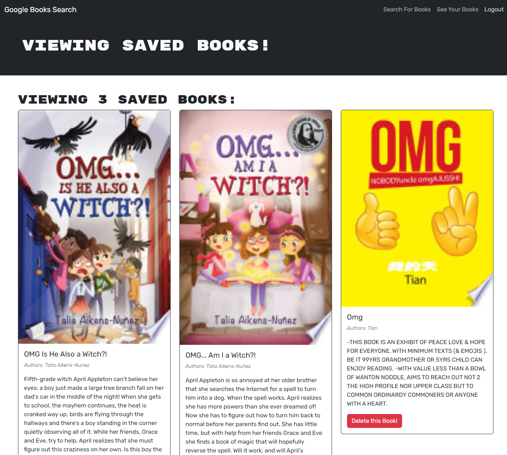

# Save-A-Book
  ## Description
  This is a Mongoose running database that is routed with Apollo GraphQL. It was originally routed with express and converted.
  
  ## Table of Contents

  [Installation](#installation)
  
  [Usage](#usage)
  
  [License](#license)
  
  [Contributing](#contributing)
  
  [Questions](#questions)

  ## Installation
  Install package.json file in the root directory with the npm run install command (this should install in both client and server as well) run the server from the root directory with npm run develop. Site is ready for deployment to a host such as Heroku.

  ## License
  

  https://opensource.org/licenses/MIT

  Copyright 2023 kylatae

     
        Permission is hereby granted, free of charge, to any person obtaining a copy of this software and associated documentation files (the “Software”), to deal in the Software without restriction, including without limitation the rights to use, copy, modify, merge, publish, distribute, sublicense, and/or sell copies of the Software, and to permit persons to whom the Software is furnished to do so, subject to the following conditions:
        
        The above copyright notice and this permission notice shall be included in all copies or substantial portions of the Software.

        THE SOFTWARE IS PROVIDED “AS IS”, WITHOUT WARRANTY OF ANY KIND, EXPRESS OR IMPLIED, INCLUDING BUT NOT LIMITED TO THE WARRANTIES OF MERCHANTABILITY, FITNESS FOR A PARTICULAR PURPOSE AND NONINFRINGEMENT. IN NO EVENT SHALL THE AUTHORS OR COPYRIGHT HOLDERS BE LIABLE FOR ANY CLAIM, DAMAGES OR OTHER LIABILITY, WHETHER IN AN ACTION OF CONTRACT, TORT OR OTHERWISE, ARISING FROM, OUT OF OR IN CONNECTION WITH THE SOFTWARE OR THE USE OR OTHER DEALINGS IN THE SOFTWARE.

  ## Contributing
  Currently this is a solo project and has reached its conclusion for progress.

  ## Questions
  Please contact me using my github page at https://www.github.com/kylatae or email at kylatae@gmail.com

  ## Preview Page

Repo Link:[https://github.com/kylatae/save-a-book](https://github.com/kylatae/save-a-book)
Deployed Site: [https://kylatae-save-a-book-a485871b6375.herokuapp.com/](https://kylatae-save-a-book-a485871b6375.herokuapp.com/)
